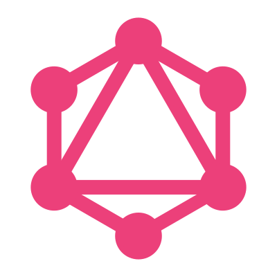

# Hi there, I'm Beto! 👋

```javascript
const me = {
  handle: '@betomossmann',
  tagline: 'Software Engineer, DevHead for creative and challenging projects!'
}
```

## Links 🔗

Find me online:

<a href="https://beto.dev.br"></a>
<a href="https://linkedin.com/in/gilbertomossmann/"></a>
<a href="https://github.com/betomossmann"></a>
<a href="https://gitlab.com/betomossmann"></a>

## TechStack 💾

**Languages**

<div>
    
    
</div>

**Frameworks, tools and other stuff**

<div>
    
    
    
    
    
    
    
    
    
    
    
    
</div>
<br/>
<div>
    
    
    
    
    
    
    
    
    
    
    
    
    
    
</div>
<br/>
<div>
    
    
    
    
    
    
    
    
    
    
    
    
</div>
